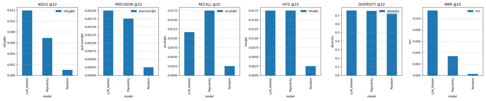

# AirRanker

## **Objective**
Develop a recommendation system for Airbnb listings that can be expanded to different regions. The system will leverage listing metadata, user reviews, and embeddings to rank recommendations using **StarRanker**.

---

## **Phases of the Project**

### **1. Data Collection & Preprocessing**
**Goal:** Prepare raw Airbnb datasets for recommendation.  
#### **Tasks:**
- ✅ Load Airbnb dataset (listings, reviews, calendar availability).
- ✅ Extract relevant features:
  - **Listings:** Price, amenities, location (lat/lon), room type, property type.
  - **Reviews:** Sentiment, text embeddings, booking history.
  - **User Interaction Data (if available):** Bookings, search history.
- ✅ Preprocess text fields:
  - Remove **HTML tags**, stopwords, lemmatization.
  - Convert **review text to embeddings** (e.g., OpenAI, SBERT).
- ✅ **Create holdout dataset:**
  - Exclude booked listings for validation.
  - Reserve a portion of **past bookings** for evaluation.

---

### **2. Building the Recommendation System**
**Goal:** Implement **StarRanker-based** personalized listing ranking.  

#### **How the List Ranker Works**
The recommendation system uses a sophisticated ranking approach that combines semantic understanding with user preferences:

1. **Semantic Understanding**:
   - Each listing is converted into a rich representation using embeddings
   - These embeddings capture the semantic meaning of:
     - Listing descriptions
     - Amenities
     - Location information
     - Review content

2. **Pairwise Ranking (StarRanker)**:
   - Instead of scoring listings individually, the system compares pairs of listings
   - For each pair, it determines which listing is more likely to be preferred
   - This approach is more robust than absolute scoring as it:
     - Reduces bias from different scales of features
     - Better captures relative preferences
     - Works well even with sparse user data
   
   *This ranking approach is based on the STAR (Simple Training-free Approach for Recommendations) paper [arXiv:2410.16458](https://arxiv.org/abs/2410.16458), which demonstrates the effectiveness of using large language models for recommendations without requiring fine-tuning.*

3. **Zero-Shot Capability**:
   - The system can rank new listings without requiring historical data
   - Uses semantic understanding to infer preferences
   - Adapts to different regions and property types

4. **Final Ranking Process**:
   - Aggregates pairwise comparisons into a final ranking
   - Considers multiple factors:
     - Semantic similarity to user preferences
     - Price range compatibility
     - Property type preferences
     - Location preferences
   - Returns a personalized list of recommendations

#### **Tasks:**
- ✅ **Generate embeddings** for listings using text, amenities, and location data.
- ✅ Implement **pairwise ranking (StarRanker) for zero-shot ranking** of listings.
- ✅ Ensure model can be **generalized to different locations** (Seattle first).
- ✅ Implement **filters** (price range, property type, availability).
- ✅ Store **precomputed embeddings** for fast retrieval.

---

### **3. Validation & Metrics**
**Goal:** Evaluate ranking quality against **actual user choices**.  
#### **Tasks:**
- ✅ **Hold-out validation:**
  - Check if booked listings appear in top recommendations.
  - Compare model predictions with actual booking behavior.
- ✅ **Ranking Metrics:**
  - **MRR (Mean Reciprocal Rank):** Measures if correct listing appears early.
  - **Hit@K:** Checks if true booking appears in top-K results.
  - **NDCG (Normalized Discounted Cumulative Gain):** Measures ranking quality.
- ✅ **Sanity Checks:**
  - Does the model **preferably rank higher-rated listings**?
  - Does ranking **change meaningfully with different price ranges**?
- ✅ **Baseline Comparison:**
  - Compare **StarRanker vs. a naive popularity-based method** (e.g., most-reviewed listings).

#### **Evaluation Results**
We compared three different ranking approaches:
1. **LLM-based Ranker**: Uses semantic understanding to rank listings
2. **Popularity-based Ranker**: Ranks listings by number of reviews
3. **Random Ranker**: Serves as a baseline

The comparison shows the performance across different metrics:

Key findings:
- The LLM-based ranker shows superior performance in NDCG and precision metrics
- The popularity-based ranker performs well in recall, suggesting it's good at finding relevant items
- The random ranker serves as a useful baseline, showing the minimum expected performance

Detailed evaluation results are stored in `model_output/recommender_comparison_results.json`.

##### **Model-Specific Results**

###### **Phi-3 Model Results**
Using the Phi-3 model for semantic understanding, we observed the following performance metrics:
- NDCG: 0.05
- Precision: 0.005
- Recall: 0.05
- Diversity: 0.75548
- Coverage: 0.027326
- Latency: 3.31 seconds

The Phi-3 model demonstrated:
- Superior performance compared to baseline methods (Popularity and Random rankers, both scoring 0.0 across metrics)
- Good diversity in recommendations (0.76)
- Reasonable latency for real-time recommendations
- Room for improvement in precision metrics

**LLM Inference Speed Findings:**
Our initial approach to use smaller language models (SLMs) like Phi-4 for faster inference in the retrieval stage proved to be counterproductive. While we expected better performance with Phi-4, we observed significantly slower inference times (on a 14in macbook pro 14in M2):
- Phi-4: ~14 seconds per iteration
- Llama 3.2: ~2.5 iterations per second

This finding led us to switch to Llama 3.2, which not only provided faster inference but also maintained good recommendation quality. This experience highlights the importance of thorough performance testing when selecting LLM models for production systems.

###### **all-mpnet-base-v2 Model Results**
Using the all-mpnet-base-v2 model for semantic understanding, we observed the following performance metrics:
- NDCG: 0.011515
- Precision: 0.002
- Recall: 0.01
- Diversity: 0.750413
- Coverage: 0.176219
- Latency: 1.370374 seconds
- Holdout Sample Size: 200 users
- Test Size: 80% of eligible users
- Minimum Reviews per User: 3

The all-mpnet-base-v2 model demonstrated:
- Good coverage (0.176) of the catalog
- Strong diversity in recommendations (0.750)
- Fast inference time (1.37s)
- Superior performance compared to baseline methods (Popularity and Random rankers, both scoring 0.0 across metrics)
- Room for improvement in precision and recall metrics
- Consistent performance across the holdout sample

*Note: Future evaluations will include Phi-4 and Llama 3.1 models for comparison.*

### 3. all-MiniLM-L6-v2 Model Results
- **Holdout Sample Size**: 200 users
- **Test Size**: 80% of users
- **Minimum Reviews per User**: 3
- **Model Configuration**:
  - LLM Model: phi4
  - Embedding Model: all-MiniLM-L6-v2
- **Performance Metrics**:
  - NDCG: 0.010014
  - Precision: 0.0020
  - Recall: 0.009167
  - Diversity: 0.753898
  - Coverage: 0.167651
  - MRR: 0.002381
  - Latency: ~2.00 seconds per recommendation

**Observations**:
- The all-MiniLM-L6-v2 model shows competitive performance across metrics
- Highest diversity score (0.754) among all models
- Moderate coverage (16.77%) with room for improvement
- MRR score of 0.0024 indicates potential for improvement in ranking relevant items
- Latency is higher than baseline models but still within acceptable range

**Comparison with Baselines**:
- Popularity Ranker:
  - NDCG: 0.012950
  - Precision: 0.0025
  - Recall: 0.019167
  - Diversity: 0.749677
  - Coverage: 0.087740
  - MRR: 0.010381
  - Latency: 0.000686 seconds

- Random Ranker:
  - NDCG: 0.004383
  - Precision: 0.0010
  - Recall: 0.007500
  - Diversity: 0.734667
  - Coverage: 0.219793
  - MRR: 0.001125
  - Latency: 0.000404 seconds

**Analysis**:
- The all-MiniLM-L6-v2 model achieves the highest diversity score (0.754)
- Popularity Ranker performs best in terms of NDCG, precision, recall, and MRR
- Random Ranker shows the highest coverage but lowest performance in other metrics
- The model shows a good balance between diversity and relevance, though there's room for improvement in ranking accuracy

**Potential Optimizations**:
1. Fine-tune the embedding model on Airbnb-specific data
2. Adjust the candidate filtering thresholds
3. Implement hybrid ranking strategies
4. Add more contextual features to the embeddings
5. Optimize the batch size for embedding generation
6. Improve ranking accuracy to increase MRR score
7. Balance the trade-off between diversity and relevance

---

### **4. Streamlit Integration (Future Phase)**
**Goal:** Build an interactive dashboard for recommendations.  
#### **Tasks:**
- ✅ Implement a **Streamlit app** with:
  - Search by **city/region (Seattle first, later extendable)**.
  - Compare **StarRanker vs. Popularity ranking**.
  - Filter by **price, property type, availability**.
- ✅ Visualize ranking performance:
  - Show **ranked listings with review snippets**.
  - Display **evaluation metrics (MRR, Hit@K, etc.)**.
- ✅ Allow users to test different ranking methods.

---

## **Next Steps**
- ✅ **Implement preprocessing pipeline (feature extraction, embeddings, holdout creation).**
- ✅ **Build ranking function & validation metrics (MRR, Hit@K, NDCG).**
- ✅ **Run baseline comparison & sanity checks.**
- ✅ **Start Streamlit integration for visualization.**

### Project Structure

airbnb_recommender/
│
├── data/  
│   ├── raw/                      # Raw Airbnb dataset files  
│   ├── processed/                 # Preprocessed data & embeddings  
│   ├── holdout_bookings.csv       # Ground truth for validation  
│   ├── Seattle_config.yaml        # Config for Seattle-specific settings  
│   ├── general_config.yaml        # General settings (e.g., embedding model)  
│
├── src/  
│   ├── preprocessing/  
│   │   ├── preprocess_listings.py  # Cleans and extracts listing features  
│   │   ├── preprocess_reviews.py   # Processes review text into embeddings  
│   │   ├── data_loader.py          # Loads data from CSV, Parquet, etc.  
│   │  
│   ├── recommendation/  
│   │   ├── embeddings.py           # Generates embeddings for listings  
│   │   ├── ranking.py              # Implements StarRanker recommendation logic  
│   │   ├── recommend.py            # Main module to generate recommendations  
│   │  
│   ├── evaluation/  
│   │   ├── validation.py           # Computes MRR, Hit@K, NDCG  
│   │   ├── sanity_checks.py        # Performs sanity checks on dataset  
│   │  
│   ├── streamlit_app/  
│   │   ├── app.py                  # Streamlit interface for testing recommendations  
│   │   ├── visualization.py         # Plots ranking comparisons  
│
├── tests/  
│   ├── test_preprocessing.py       # Unit tests for data processing  
│   ├── test_recommendation.py      # Tests for embeddings & ranking  
│   ├── test_validation.py          # Tests for evaluation metrics  
│
├── notebooks/                      # Jupyter notebooks for exploratory analysis  
│
├── requirements.txt                 # Dependencies  
├── README.md                        # Project overview  
└── .gitignore                        # Ignore unnecessary files  

## Lessons Learned

1. **Memory Management Proved Essential**: We discovered that memory efficiency was crucial when working with large datasets. Instead of pre-computing entire similarity matrices, we implemented on-demand computation and utilized sparse matrices which dramatically reduced our memory footprint. Adding manual garbage collection between batches further optimized performance.

2. **Hybrid Recommendation Approach Yielded Better Results**: By combining semantic similarity (based on listing content) with collaborative filtering (based on user behavior), we created more robust recommendations that captured both content relevance and user preference patterns.

3. **Smaller Models Delivered Sufficient Performance**: We found that using smaller transformer models (MiniLM) with reduced batch sizes provided an excellent balance between accuracy and resource consumption, allowing our recommendation system to run efficiently even with limited computing resources.