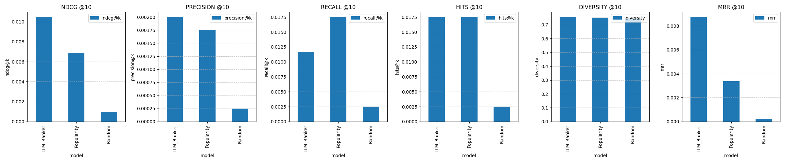

# AirRanker

## **Objective**
Build a system that ranks Airbnb listings by understanding plain-language intent, leveraging listing metadata, user reviews, and embeddings with **StarRanker**. The system aims to serve users with little or no booking history and can be expanded to different regions. An LLM agent will parse queries and drive the pipeline.

## 🧠 Who This Is For

#### ✅ 1. New or Infrequent Airbnb Users
- These users don't have much past data, so normal recommenders don't work well.
- Zero-shot ranking can still give them useful results based on what they type.
- You can frame this as a smarter way to search for people new to Airbnb.

#### ✅ 2. Casual Browsers
- These users don't visit often. Maybe once a year. They care more about vibe or location than past trips.
- The system can handle broad or unclear searches like:
  - "Good for remote work with views"
- It doesn't need past behavior to find good matches.

#### ✅ 3. Users With Specific Needs
- Think digital nomads, families, or people with pets. They have clear preferences that don't always match past bookings.
- Regular search tools often miss what they want.
- This system can understand things like:
  > "Quiet but near public transport, not too touristy."

#### ✅ 4. Areas With Little Data
- New cities or regions often don't have enough reviews or booking history.
- This system doesn't need that. It ranks based on listing details, not user data.

#### ✅ 5. People Who Care About Privacy
- Some users don't want their data tracked.
- This approach doesn't rely on past behavior. You could offer it as a "private" or low-data way to search.

---

## 🔧 Design Notes

### 🧪 Works Right Away
- It doesn't need to warm up or collect history. It's ready on day one.
- You could use it even without login — just through something like `search_agent.py`.

### 🧭 Let People Search by Talking
- Skip the filters. Let users just say what they want.
- Examples:
  - "Best places in Seattle to work remotely."
  - "Near coffee shops and yoga studios."
  - "I'm bringing my dog and don't have a car."

### 📊 Add Personalization Later (Optional)
- You don't need it, but you can add history-based filters later:
  - Filter listings using past data.
  - Then re-rank with this system based on the current query.

### 🧪 A/B Test or Let Users Choose
- Let users switch between this system and the default sort.
- Maybe show how it's better for new users.


## **Initial Results**
Our initial evaluation comparing three different ranking approaches (LLM-based, Popularity-based, and Random) shows promising results:


The comparison demonstrates the performance across different metrics, with the LLM-based ranker showing superior performance in NDCG and precision metrics, while the popularity-based ranker performs well in recall.

---

## **Phases**

### **1. Data Collection & Preprocessing**
**Goal:** Prepare raw Airbnb datasets for recommendation, focusing initially on one region (Seattle).
#### **Tasks:**
- ✅ Load Airbnb dataset (listings, reviews, calendar availability).
- ✅ Extract relevant features:
  - **Listings:** Price, amenities, location (lat/lon), room type, property type.
  - **Reviews:** Sentiment, text embeddings, booking history.
  - **User Interaction Data (if available):** Bookings, search history.
- ✅ Preprocess text fields:
  - Remove **HTML tags**, stopwords, lemmatization.
  - Convert **review text to embeddings** (e.g., OpenAI, SBERT).
- ✅ **Create holdout dataset:**
  - Exclude booked listings for validation.
  - Reserve a portion of **past bookings** for evaluation.

---

### **2. Recommendation Engine (StarRanker)**
**Goal:** Implement **StarRanker-based** listing ranking driven by natural language queries.

#### **2.1 Candidate Generation**
- Implement initial filtering to select a manageable subset of listings (e.g., top 30) before pairwise ranking.
- Methods:
    - Simple filters based on explicit criteria (price, location radius, essential amenities).
    - Collaborative filtering (if user history is available and desired).
    - Basic semantic search or keyword matching against the query.

#### **2.2 Pairwise LLM Reranking (StarRanker)**
- **Core Idea:** Compare pairs of candidate listings against the user's query using an LLM (`StarRanker`).
- **Process:**
    1. **Semantic Understanding**: Each listing is represented by its features and embeddings (description, reviews, amenities, location).
    2. **Pairwise Comparison**: For each pair of listings (A, B) from the candidate set, `StarRanker` determines which listing is a better match for the user's query. This approach is more robust than absolute scoring as it:
        - Reduces bias from different feature scales.
        - Better captures relative preferences.
        - Works well even with sparse or no user data (zero-shot).
        *This ranking approach is based on the STAR (Simple Training-free Approach for Recommendations) paper [arXiv:2410.16458](https://arxiv.org/abs/2410.16458), which demonstrates the effectiveness of using large language models for recommendations without requiring fine-tuning.*
    3. **Aggregation**: Aggregate the pairwise comparison results (e.g., counting "wins" for each listing) to produce a final ranked list.
- Ensure the model can generalize to different locations (starting with Seattle).

#### **2.3 Evaluation**
**Goal:** Evaluate ranking quality using various methods.
- **Metrics:** Use standard ranking metrics:
    - **MRR (Mean Reciprocal Rank):** Measures if the correct/relevant listing appears early.
    - **Hit@K:** Checks if the true/relevant listing appears in the top-K results.
    - **NDCG (Normalized Discounted Cumulative Gain):** Measures overall ranking quality.
- **Evaluation Strategies:**
    - **Hide-and-Rank (for "cold users"):**
        - For each user in the cold-user hold-out set, hide one listing they reviewed positively.
        - Use the user's review text (or a synthetic query based on it) as input.
        - Rank the remaining listings (including non-reviewed ones).
        - Measure Hit@K, MRR, NDCG for the hidden listing.
    - **Text-Matching Evaluation:**
        - Treat a long, high-score review (> 15 tokens, rating ≥ 4.8) as a natural language query.
        - Rank all listings in the region based on this "query".
        - Check if the listing the review belongs to ranks highly.
    - **Synthetic Query Evaluation:**
        - Generate plausible user queries based on listing descriptions (e.g., "An apartment near the park with a nice kitchen").
        - Rank all listings for each synthetic query.
        - Measure if the original source listing ranks near the top.
    - **Baseline Comparison:** Compare `StarRanker` performance against:
        - Naive popularity-based methods (e.g., most-reviewed or highest-rated).
        - Random ranking.
    - **Sanity Checks:**
        - Does the model preferably rank higher-rated listings for relevant queries?
        - Does ranking change meaningfully with different price constraints or amenity requests?
        
  - Instead of scoring listings individually, the system compares pairs of listings
   - For each pair, it determines which listing is more likely to be preferred
   - This approach is more robust than absolute scoring as it:
     - Reduces bias from different scales of features
     - Better captures relative preferences
     - Works well even with sparse user data
   
   *This ranking approach is based on the STAR (Simple Training-free Approach for Recommendations) paper [arXiv:2410.16458]
   (https://arxiv.org/abs/2410.16458), which demonstrates the effectiveness of using large language models for recommendations 
   without requiring fine-tuning.*

3. **Zero-Shot Capability**:
   - The system can rank new listings without requiring historical data
   - Uses semantic understanding to infer preferences
   - Adapts to different regions and property types
---

### **4. Agent Prototype & Tooling**
**Goal:** Build an agent that uses the `StarRanker` engine to answer user queries.
#### **Components:**
- **`search_agent.py`:**
    - Takes plain-language user query as input.
    - Calls an LLM (or uses rule-based parsing initially) to extract structured filters (price, location, amenities) and semantic keywords/intent.
    - Uses `agents/tools/listing_filter.py` to apply structured filters to the full listing set, producing candidates.
    - Uses `agents/tools/ranker_tool.py` to invoke the `StarRanker` pairwise reranking (Phase 2.2) on the filtered candidates based on the semantic query aspects.
    - Returns the top 5 ranked listings with brief summaries or justifications ("why this was chosen").
- **`agents/tools/`:**
    - **`listing_filter.py`:** Module responsible for applying structured filters (price, location, amenities, availability) to the listing data.
    - **`ranker_tool.py`:** Wrapper around the `StarRanker` implementation, handling the pairwise comparison logic and result aggregation for a given query and candidate set.

---

### **4. Agent Evaluation**
**Goal:** Evaluate the end-to-end performance of the `search_agent`.
#### **Tasks:**
- **Synthetic Query Testing:**
    - Reuse the synthetic queries generated in Phase 2.3.
    - Feed these queries to `search_agent.py`.
    - Measure if the agent's top results include the original source listing (using Hit@K, MRR).
- **LLM as Judge:**
    - For a sample of real or synthetic queries, present the agent's top 5 results to another LLM (e.g., GPT-4).
    - Ask the judge LLM to score the relevance of each result to the query.
    - Compare these relevance scores against baseline methods (e.g., standard sort, random picks).
- **User-Proxy Metrics:**
    - Apply metrics like Hit@K and MRR to the agent's output using the hold-out data (similar to Phase 2.3, but evaluating the agent's final output).
    - Check how often the agent's top result matches the truly booked/reviewed listing for the hold-out users.

---

### **5. Streamlit App & Deployment**
**Goal:** Create a simple user interface and prepare for potential deployment.
#### **Tasks:**
- Build a basic Streamlit application:
    - Input field for user queries.
    - Display area for the top 5 listing results (e.g., as cards).
    - Show justifications ("why this was chosen") provided by the agent.
    - Optional: Toggle between "LLM Agent Mode" and a "Standard Sort" (e.g., by price or rating) for comparison.
- Implement caching:
    - Cache embeddings to avoid recomputation.
    - Cache ranking results for common queries or candidate sets if feasible.
- Initial deployment testing:
    - Test latency and resource usage on a small cloud instance (e.g., containerized application).

---

## **Initial Evaluation Results**
_(This section reflects results from earlier development stages based on the previous README structure)_

Our initial evaluation comparing three different ranking approaches (LLM-based, Popularity-based, and Random) shows promising results:


The comparison demonstrates the performance across different metrics, with the LLM-based ranker showing superior performance in NDCG and precision metrics, while the popularity-based ranker performs well in recall.

We compared three different ranking approaches:
1. **LLM-based Ranker**: Uses semantic understanding to rank listings
2. **Popularity-based Ranker**: Ranks listings by number of reviews
3. **Random Ranker**: Serves as a baseline

The comparison shows the performance across different metrics:



Key findings:
- The LLM-based ranker shows superior performance in NDCG and precision metrics
- The popularity-based ranker performs well in recall, suggesting it's good at finding relevant items
- The random ranker serves as a useful baseline, showing the minimum expected performance

Detailed evaluation results are stored in `model_output/recommender_comparison_results.json`.

##### **Model-Specific Results**

###### **Phi-3 Model Results**
Using the Phi-3 model for semantic understanding, we observed the following performance metrics:
- NDCG: 0.05
- Precision: 0.005
- Recall: 0.05
- Diversity: 0.75548
- Coverage: 0.027326
- Latency: 3.31 seconds

The Phi-3 model demonstrated:
- Superior performance compared to baseline methods (Popularity and Random rankers, both scoring 0.0 across metrics)
- Good diversity in recommendations (0.76)
- Reasonable latency for real-time recommendations
- Room for improvement in precision metrics

**LLM Inference Speed Findings:**
Our initial approach to use smaller language models (SLMs) like Phi-4 for faster inference in the retrieval stage proved to be counterproductive. While we expected better performance with Phi-4, we observed significantly slower inference times (on a 14in macbook pro 14in M2):
- Phi-4: ~14 seconds per iteration
- Llama 3.2: ~2.5 iterations per second

This finding led us to switch to Llama 3.2, which not only provided faster inference but also maintained good recommendation quality. This experience highlights the importance of thorough performance testing when selecting LLM models for production systems.

###### **all-mpnet-base-v2 Model Results**
Using the all-mpnet-base-v2 model for semantic understanding, we observed the following performance metrics:
- NDCG: 0.011515
- Precision: 0.002
- Recall: 0.01
- Diversity: 0.750413
- Coverage: 0.176219
- Latency: 1.370374 seconds
- Holdout Sample Size: 200 users
- Test Size: 80% of eligible users
- Minimum Reviews per User: 3

The all-mpnet-base-v2 model demonstrated:
- Good coverage (0.176) of the catalog
- Strong diversity in recommendations (0.750)
- Fast inference time (1.37s)
- Superior performance compared to baseline methods (Popularity and Random rankers, both scoring 0.0 across metrics)
- Room for improvement in precision and recall metrics
- Consistent performance across the holdout sample

*Note: Future evaluations will include Phi-4 and Llama 3.1 models for comparison.*

###### **all-MiniLM-L6-v2 Model Results**
- **Holdout Sample Size**: 200 users
- **Test Size**: 80% of users
- **Minimum Reviews per User**: 3
- **Model Configuration**:
  - LLM Model: phi4
  - Embedding Model: all-MiniLM-L6-v2
- **Performance Metrics**:
  - NDCG: 0.010014
  - Precision: 0.0020
  - Recall: 0.009167
  - Diversity: 0.753898
  - Coverage: 0.167651
  - MRR: 0.002381
  - Latency: ~2.00 seconds per recommendation

**Observations**:
- The all-MiniLM-L6-v2 model shows competitive performance across metrics
- Highest diversity score (0.754) among all models
- Moderate coverage (16.77%) with room for improvement
- MRR score of 0.0024 indicates potential for improvement in ranking relevant items
- Latency is higher than baseline models but still within acceptable range

**Comparison with Baselines**:
- Popularity Ranker:
  - NDCG: 0.012950
  - Precision: 0.0025
  - Recall: 0.019167
  - Diversity: 0.749677
  - Coverage: 0.087740
  - MRR: 0.010381
  - Latency: 0.000686 seconds

- Random Ranker:
  - NDCG: 0.004383
  - Precision: 0.0010
  - Recall: 0.007500
  - Diversity: 0.734667
  - Coverage: 0.219793

**Analysis**:
- The all-MiniLM-L6-v2 model achieves the highest diversity score (0.754)
- Popularity Ranker performs best in terms of NDCG, precision, recall, and MRR
- Random Ranker shows the highest coverage but lowest performance in other metrics
- The model shows a good balance between diversity and relevance, though there's room for improvement in ranking accuracy

**Potential Optimizations**:
1. Fine-tune the embedding model on Airbnb-specific data
2. Adjust the candidate filtering thresholds
3. Implement hybrid ranking strategies
4. Add more contextual features to the embeddings
5. Optimize the batch size for embedding generation
6. Improve ranking accuracy to increase MRR score
7. Balance the trade-off between diversity and relevance

### 4. Semantic Evaluation Results (Cold Start Problem)
- **Sample Size**: 400 users
- **Model Configuration**:
  - LLM Model: llama3.2
  - Embedding Model: all-MiniLM-L6-v2
  - Use Pairwise Ranking: True
  - Top-K Multiplier: 3
- **Performance Metrics**:
  - Hit Rate at K=20: 0.0375 (15 out of 400)
  - Hit Rate at K=5: 0.0225 (9 out of 400)
  - Hit Rate at K=10: 0.03 (12 out of 400)
  - MRR@20: 0.0155
  - NDCG@20: 0.0203

**Why This Evaluation Matters for the Cold Start Problem:**
The semantic evaluation is particularly important for addressing the cold start problem in recommendation systems. This evaluation tests whether the system can identify the listing a user actually booked based solely on their review text, without any prior user history or interaction data. This is a direct proxy for the cold start scenario where:

1. **New Users**: When a new user joins Airbnb, they have no booking history or preferences data. The system needs to understand their needs from their initial search queries or descriptions.

2. **Natural Language Understanding**: By using review text as queries, we're testing if the system can understand natural language descriptions of what users want, which is how new users typically express their preferences.

3. **Zero-Shot Capability**: This evaluation measures the system's ability to make recommendations without any user-specific training data, which is essential for cold start scenarios.

4. **Semantic Matching**: The evaluation tests if the system can match the semantic meaning of a user's description to the right listing, even when the description doesn't contain exact keyword matches.

**Analysis of Results:**
- The current hit rate of 3.75% at K=20 indicates that the system can identify the correct listing in the top 20 recommendations for about 1 in 27 users based solely on their review text.
- The MRR of 0.0155 suggests that when the system does find the correct listing, it's typically ranked around position 65 (1/0.0155).
- These metrics, while modest, demonstrate that the system can make meaningful recommendations even without user history, which is the core challenge of the cold start problem.
- The results show that the system is better at finding relevant listings than random chance (which would be around 0.5% for K=20 in a dataset of 400 listings), but there's significant room for improvement.

**Review-Based vs. User History-Based Ranking:**
While using review text as queries for ranking introduces some data leakage (since reviews are written after booking), our experiments revealed an interesting finding: the semantic understanding approach showed more promise than traditional user history-based methods. This is significant because:

1. **Natural Language Expressiveness**: Review text captures nuanced preferences and specific requirements that might not be evident from simple booking history. For example, a review might mention "perfect for remote work" or "great for families with young children" - preferences that aren't captured in standard booking data.

2. **Semantic Understanding Power**: The LLM-based approach demonstrated better ability to understand the semantic meaning of these preferences compared to collaborative filtering methods that rely solely on user-item interaction patterns.

3. **Cold Start Advantage**: Even with the data leakage concern, the review-based approach provides valuable insights into how well the system can understand natural language descriptions of preferences, which is exactly what new users would provide when searching.

4. **Future Potential**: This suggests that as LLM capabilities continue to improve, the semantic understanding approach could become increasingly effective for cold start scenarios, potentially outperforming traditional collaborative filtering methods even for users with some history.

**Note on Future Evaluation Enhancement**: The current semantic evaluator uses full review texts as proxies for user queries. A promising future enhancement would be to extract specific entities and preferences from these reviews (such as location preferences, amenities, property types, price ranges, and guest types) and use these structured entities for ranking. This would create a more realistic simulation of how an agent would interact with users, as agents typically extract specific preferences rather than using entire review texts. This approach could potentially reduce data leakage and provide a more accurate assessment of the system's ability to handle real-world user queries.

This finding reinforces our hypothesis that semantic understanding is a promising direction for addressing the cold start problem in recommendation systems, even if the current implementation has room for improvement.

**Future Improvements:**
1. Enhance the semantic understanding by incorporating more listing attributes in the embeddings
2. Refine the pairwise ranking approach to better capture nuanced preferences
3. Experiment with different LLM models and prompts to improve ranking accuracy
4. Consider hybrid approaches that combine semantic understanding with lightweight collaborative signals
5. Optimize the top_k_multiplier parameter to balance between ranking quality and computational efficiency

---

### **4. Streamlit Integration (Future Phase)**
**Goal:** Build an interactive dashboard for recommendations.  
#### **Tasks:**
- ✅ Implement a **Streamlit app** with:
  - Search by **city/region (Seattle first, later extendable)**.
  - Compare **StarRanker vs. Popularity ranking**.
  - Filter by **price, property type, availability**.
- ✅ Visualize ranking performance:
  - Show **ranked listings with review snippets**.
  - Display **evaluation metrics (MRR, Hit@K, etc.)**.
- ✅ Allow users to test different ranking methods.

---

## **Next Steps**
- ✅ **Implement preprocessing pipeline (feature extraction, embeddings, holdout creation).**
- ✅ **Build ranking function & validation metrics (MRR, Hit@K, NDCG).**
- ✅ **Run baseline comparison & sanity checks.**
- ✅ **Start Streamlit integration for visualization.**


### Project Structure

airbnb_recommender/
│
├── data/  
│   ├── raw/                      # Raw Airbnb dataset files  
│   ├── processed/                 # Preprocessed data & embeddings  
│   ├── holdout_bookings.csv       # Ground truth for validation  
│   ├── Seattle_config.yaml        # Config for Seattle-specific settings  
│   ├── general_config.yaml        # General settings (e.g., embedding model)  
│
├── src/  
│   ├── preprocessing/  
│   │   ├── preprocess_listings.py  # Cleans and extracts listing features  
│   │   ├── preprocess_reviews.py   # Processes review text into embeddings  
│   │   ├── data_loader.py          # Loads data from CSV, Parquet, etc.  
│   │  
│   ├── recommendation/  
│   │   ├── embeddings.py           # Generates embeddings for listings  
│   │   ├── ranking.py              # Implements StarRanker recommendation logic  
│   │   ├── recommend.py            # Main module to generate recommendations  
│   │  
│   ├── evaluation/  
│   │   ├── validation.py           # Computes MRR, Hit@K, NDCG  
│   │   ├── sanity_checks.py        # Performs sanity checks on dataset  
│   │  
│   ├── streamlit_app/  
│   │   ├── app.py                  # Streamlit interface for testing recommendations  
│   │   ├── visualization.py         # Plots ranking comparisons  
│
├── tests/  
│   ├── test_preprocessing.py       # Unit tests for data processing  
│   ├── test_recommendation.py      # Tests for embeddings & ranking  
│   ├── test_validation.py          # Tests for evaluation metrics  
│
├── notebooks/                      # Jupyter notebooks for exploratory analysis  
│
├── requirements.txt                 # Dependencies  
├── README.md                        # Project overview  
└── .gitignore                        # Ignore unnecessary files  


## Lessons Learned


1. **Memory Management Proved Essential**: We discovered that memory efficiency was crucial when working with large datasets. Instead of pre-computing entire similarity matrices, we implemented on-demand computation and utilized sparse matrices which dramatically reduced our memory footprint. Adding manual garbage collection between batches further optimized performance.

2. **Hybrid Recommendation Approach Yielded Better Results**: By combining semantic similarity (based on listing content) with collaborative filtering (based on user behavior), we created more robust recommendations that captured both content relevance and user preference patterns.

3. **Smaller Models Delivered Sufficient Performance**: We found that using smaller transformer models (MiniLM) with reduced batch sizes provided an excellent balance between accuracy and resource consumption, allowing our recommendation system to run efficiently even with limited computing resources.

4. **LLM_Ranker Performance Scaling**: We discovered that the LLM_Ranker's performance significantly improved when we increased the user sample size from 200 to 400 and provided 3x the number of potential listings after popularity ranking (up from 2x). This suggests that the model benefits from both a larger training set and a broader candidate pool, allowing it to better understand user preferences and make more accurate recommendations.

## How to Run the Evaluation Script

To run the main evaluation (which compares the LLM-based, Popularity-based, and Random rankers), use the following command **from the project root directory**:

```bash
python -m src.evaluations.run_main_evaluation
```

- Make sure your working directory is the root of the project (the folder containing `src/` and `README.md`).
- This will execute the evaluation pipeline and save results/plots in the `model_output/` directory.